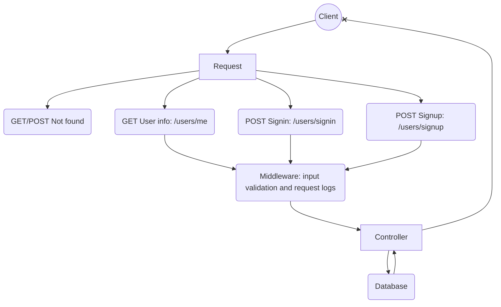

# 🚀 Teste Técnico da empresa [Escribo](https://escribo.com/): Desafio 02 
## 18/12/2023 UPDATE: projeto avaliado e aprovado ✔
## 📝 Descrição do Desafio 

Desenvolver uma API RESTful para autenticação de usuários, que permita operações de cadastro (sign up),
autenticação (sign in) e recuperação de informações do usuário..

## 💻 Tecnologias Utilizadas 
- Javascript
- NodeJs (express, jsonwebtoken, exprex-validator)
- Mongodb

## 🔎 Requisitos
```
✅ Persistência de dados: MongoDB
✅ Gerenciamento de dependências: NPM
✅ Sistema de build: Esbuild
✅ Task runner para build: Grunt
✅ Padronização de estilo: JsHint
✅ Framework: Express
✅ Token: JWT
✅ Testes unitários: Jest 
✅ Criptografia hash na senha e token: bcrypt
```


## ▶️ Como Executar o Projeto 
### Deploy: [OFF]
### Wiki de como usar a API (ctrl + click): [WIKI](https://github.com/iFuzzing/escrimboteste2-backend/blob/main/WIKI.md)
### Arquivo do [Postman](https://www.postman.com/downloads/) para testar a API: [OFF]
---
### Localmente:
> Certifique-se de ter uma arquivo .env dentro do projeto e que nele esteja configurado corretamente suas variáveis de ambiente, são elas:
```
 ACCESS_TOKEN_SECRET = ..
 DATABASE_URI=...
 FRONTEND_URL= 
```
> SECRET é uma chave aleatória para uso correto do JsonWebToken 

> URI é seu link de conexão com o mongodb

>URL é opcional ter um valor dentro, mas obrigatório a existência da variável.
```bash
git clone https://github.com/iFuzzing/escrimboteste2-backend.git

#extraia o projeto, depois:
cd escriboteste2-backend

# configure suas variáveis de ambiente .env, depois:
npm install

# Apenas testes unitários e JsHint
npm run test

# Build (testes incluso)
npm run build

# Start
npm run start

```
---
## :dart: Endpoints
| Endpoint      | Método | Descrição                                    | Header  |   |
|---------------|--------|----------------------------------------------|---|---|
| /users/signin | `POST`   | Autenticação do usuário                      | Content-Type: application/json  |   |
| /users/signup | `POST`   | Registro de uma nova conta                   | Content-Type: application/json  |   |
| /users/me     | `GET`    | Obtém informações sobre o usuário autenticado | Content-Type: application/json <br /><br/>  `Authorization: Barear {token}`|   |
| *     		| `GET`/`POST`| 404 Not found | Content-type: application/json  |   |


## :building_construction: Estrutura do projeto
````
│   App.js
│   Server.js
│
├───Controllers
│       users.js
│
├───Middleware
│   ├───Logs
│   │       reqLogs.js
│   │
│   ├───Protections
│   │       routeProtection.js
│   │
│   └───Validate
│           validateUsers.js
│
├───Models
│       dbConnect.js
│       users.js
│
├───Routes
│       root.js
│       users.js
│
└───Utils
        utils.js
````
